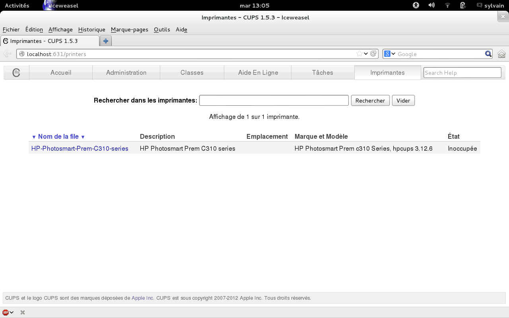
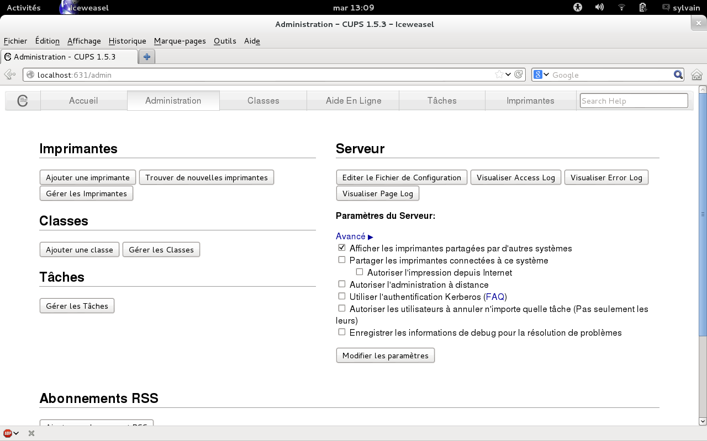
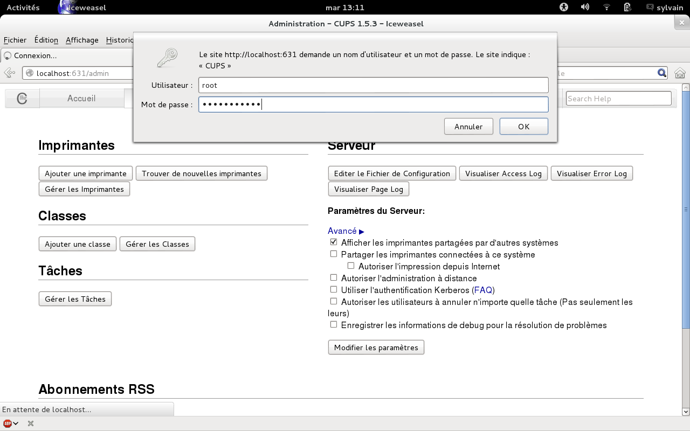

# Gestion des Imprimantes

## Installation du paquet CUPS

- Paquet d'administration des imprimantes
    - apt update
    - apt install cups

## Paramétrage de CUPS.

### En ligne de commande
- Listing des imprimante atteignables pour récupérer les adresses des imprimantes à ajouter.
        
    ```bash
    lpinfo -v
    ```

- Préparation du driver de l'imprimante
    - Télécharger le driver adapté à l'imprimante sur le site [https://openprinting.org/printers](https://openprinting.org/printers)
    - Le télécharger dans le dossier tmp de la machine via winscp

- Le placer dans le dossier des drivers de cups
        
    ```bash
    mv /tmp/"driver" /usr/share/cups/model/
    ```

    - Exemple
        
        ```bash
        mv /tmp/Ricoh-IM_C2000-PDF-Ricoh.ppd /usr/share/cups/model/
        ```

- Création d'une imprimante
        
    ```bash
    lpadmin -p "imprimante" -E -v "périphérique" -m "driver" -L "description"
    ```

    - Exemple:
            
        ```bash
        lpadmin -p IMP-001 -E -v socket://192.168.44.51 -m Ricoh-IM_C2000-PDF-Ricoh.ppd -L "Imprimante 1er étage Orvault"
        ```

- Passage de l'imprimante en imprimante par défaut
        
    ```bash
    lpadmin -d "imprimante"
    ```

    - Exemple:
            
        ```bash
        lpadmin -d IMP-001
        ```

### Par Interface graphique
- Via un navigateur internet, la configuration est accessible à l'adresse [http://localhost:631/printers](http://localhost:631/printers)
- Normalement votre imprimante apparaît.
        
      
        
- En cliquant sur l'onglet administration vous pouvez administrer votre imprimante
        
      
        
- Mais pour cela il va falloir vous identifier, on vous demande un nom d'utilisateur : root et un mot de passe : celui de root.
        
      
        
- Dans le cas d'une configuration utilisant sudo, vous tapez le nom d'utilisateur principal et son mot de passe.
- Si votre imprimante n’apparaît pas, vous pouvez tenter de la rajouter manuellement en cliquant sur “Ajouter une imprimante”.
- Il y a aussi une aide en ligne bien pratique, en particulier la section “Man Pages”.