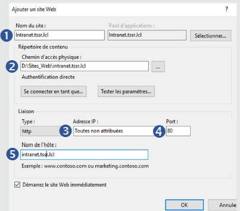

  

    
  

  <h1 align="center">Serveurs Web IIS</h1>

---
# Installation du service IIS

 

# Création de sites

- Créer un répertoire de stockage global
- Créer un répertoire individuel par site
- Dans l’outils IIS du serveur
    - Ajoutez un site Web
        
          
        
    - Définissez le site
        1. Donnez un nom au site
        2. Définissez le chemin d’accès au site (local ou UNC)
        3. Indiquez une @IP si le site est accessible par une @IP spécifique
        4. Indiquez le port si le site est accessible par un port spécifique
        5. Indiquez un FQDN si le site est accessible par un nom spécifique
        
          
        
    - Création du fichier de démarrage du site (pour test du site)
        - créer un fichier index.html.txt
        - supprimer de.txt pour le rendre lisible pour un site

# Sécurisation de la connexion

- Générer un certificat auto-signé (⇒ pas ouf en terme sécu)
    - Création à partir de la configuration global
        - Certificats de serveur
            - Créer un certificat auto-signé
                
                  
                
            - Indiquer le nom du site (www.site.domaine)
            - Magasin de certificats (Hébergement web)
                
                  
                
- Générer un certificat via autorité de certification ⇒ pki
    - Installer un PKI (Private Key Infrastructure)
        - Installer le rôle
            - Rôle à installer: “Service de certificat Active Directory”
            
              
            
            - Choisir les services du rôle à installer
                
                  
                
            - Effectuer l’installation
        - Configuration post-déploiement
            - Configurer les services de certificats
                - Vérifier le compte de l’administrateur
                    
                      
                    
                - Sélectionner les rôles à configurer
                    
                      
                    
                - Spécifier le type d’installation
                    
                      
                    
                - Spécifier le type de l’AC
                    
                      
                    
                - Spécifier le type de la clé privée
                    
                      
                    
                - Spécifier le chiffrement à utiliser
                    
                      
                    
                - Spécifier le nom de l’AC
                    
                      
                    
                - Spécifier la période de validité
                    
                      
                    
                - Contrôler le résumé de l’installation
                - Installation terminée
    - Consultation certificat du serveur ⇒ sur serveur gérant les certificats
        - Dans la console “autorité de certification:
            - clique droit sur le serveur
            - propriété
            - afficher le certificat
                
                  
                
    - Création de modèle de certificat IIS ⇒ sur serveur gérant les certificats
        - Dans la console “autorité de certification:
            - clique droit sur l’UO “Modèle de certificat”
            - Gérer
            - Clique droits dupliquer le template de certificat souhaité
                
                  
                
            - Onglet Compatibilité
                - Choisir l’autorité de certification et le destinataire du certificat en fonction des données réelles
            - Onglet Général
                - saisir le nom complet du modèle
                
                >⚠️ Bonne pratique ⇒ ça doit être le nom du site
                
                - Cocher la publication dans l’AD si un active directory gère le SI.
            - Onglet Sécurité
                - définir les utilisateur (ou groupe d’utilisateur) qui à des droits sur le certificat.
                - si géré par AD, ajouter le serveur/ordinateur qui devra faire les requêtes de certificat
    - Publication du modèle ⇒ sur serveur gérant les certificats
        - Dans la console “autorité de certification:
            - clique droit sur l’UO “Modèle de certificat”
            - Nouveau
                - Modèle de certificat à délivrer
            - sélectionner le modèle de certificat souhaité
            - valider
    - Installation du certificat ⇒ sur serveur gérant le site
        - Dans console certlm.msc
            - Personnel
                - Clic droit
                    - Toutes les tâches
                        - Demander un nouveau certificat
            - Si intégrant un active directory
                - séléctionner la stratégie AD
                    - suivant
                - Sélectionner le certificat souhaité
                - Configurer les paramètres
            - configurer les informations supplémentaires
                - onglet objet
                    - Nom du sujet
                    - Nom commun (FQDN du site)
                    - DNS ⇒ important pour que le certificat soit reconnu sur les new explorateurs
                        
                          
                        
                - onglet général
                    - Nom convivial
                    - Description
            - Valider les informations
            - Lancer l’inscription
        - Vérification présence certificat
            - Dans console certlm.msc
                - dérouler l’UO “personnel” il doit être lister dedans.
- Mise en place certificat sur le site
    - sur le site souhaité ⇒ sur serveur gérant le site
        - dans le menus des liaisons du site
        - créer une liaison en https (ou modifier une existante)
        - mettre le port souhaité (défauts 443 pour https)
        - saisir le FQDN en nom d’hôte
        - sélectionner le certificat créé précédemment
            
              
            
        - redémarrer le site